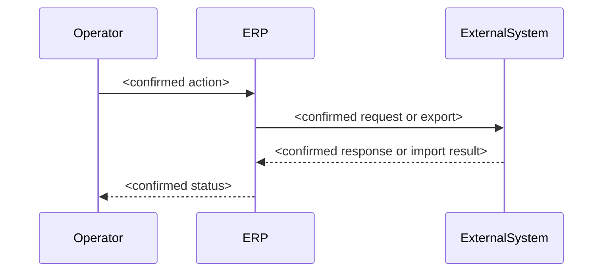

# Data and Integration Flow Patterns

Use this reference only when the proposed Epic includes a confirmed process across three or more components, or an external integration whose handoff needs clarification. Do not infer technical components from a business request.

## Rules

- Derive actors, systems, data, and sync/async behaviour from approved docs or clearly label them as open questions.
- Show a complete handoff: initiator, processing system, durable record when applicable, and returned/next state.
- Keep error, retry, reconciliation, and manual-intervention paths visible when they affect operations.
- A diagram explains a proposal; it does not approve a workflow or data model.

## Template

## Dependency map template

